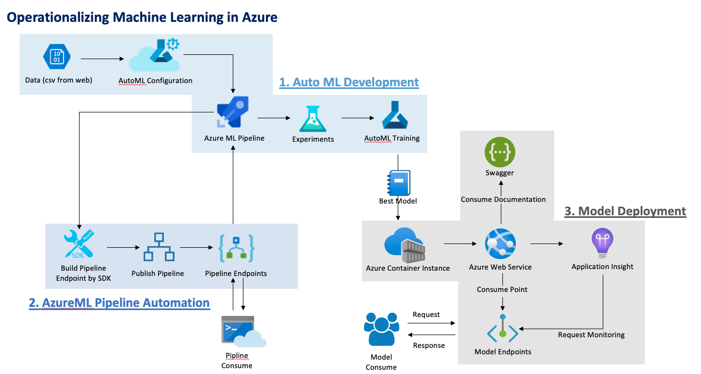

# Machine Learning Engineer with Azure
To collect all of project materials from Machine Learning Engineer with Azure from Udacity

## Project 1 - [Optimizing an ML Pipeline in Azure](https://github.com/wasuratme96/MSAzure-ML-Engineer/tree/main/Optimize%20an%20Azure%20ML%20Pipeline)

In this project, I have created and optimize an ML pipeline by using custom training model script from Logistic Regression and perform hyperparameters tuning by HyperDrive. Comparing with AutoML to build and optimize the model.  

Both of pipeline will be compared and tracked on AzureML Studio.
> * **Dataset**  
>Bank Marketing from [UCI-ML Repository](https://archive.ics.uci.edu/ml/datasets/Bank+Marketing)
> * **Problem Statement**  
>To predict will customer subscribe the bank deposit program or not ? (Yes vs. No.)  
> * **Model Type**  
>Binary Classification

## Project 2 - [Operationalizing ML on azure]()

This project focus on operationalzation machine learning process on Azure Machine Learning. Starting from model development to create the pipeline of model and monitoring the status of deployed endpoints.

> * **Dataset**  
>Bank Marketing from [UCI-ML Repository](https://archive.ics.uci.edu/ml/datasets/Bank+Marketing)
> * **Problem Statement**  
>To predict will customer subscribe the bank deposit program or not ? (Yes vs. No.)  
> * **Tool Inuse**  
> Azure Python SDK, Application Insight, Azure container instance, AutoML, Swagger and Apache Benchmark

## Project 3 - [Google Brain - Ventilator Pressure Prediction](xxxxxxxxxxxx)

The ventilator data used in this competition was produced using a modified [open-source ventilator](https://www.peoplesvent.org/en/latest/) connected to an [artificial bellows](https://www.ingmarmed.com/product/quicklung/) test lung via a respiratory circuit. The diagram below illustrates the setup, with the two control inputs highlighted in green and the state variable (airway pressure) to predict in blue. The first control input is a continuous variable from 0 to 100 representing the percentage the inspiratory solenoid valve is open to let air into the lung (i.e., 0 is completely closed and no air is let in and 100 is completely open). The second control input is a binary variable representing whether the exploratory valve is open (1) or closed (0) to let air out.

In this competition, participants are given numerous time series of breaths and will learn to predict the airway pressure in the respiratory circuit during the breath, given the time series of control inputs.

